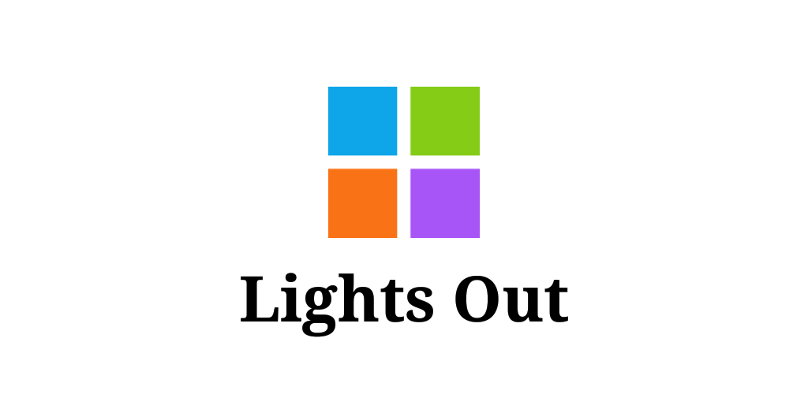

# Lights Out

Lights Out is a puzzle game.

Touching a brick will change its color and the color of the surrounding bricks, change the color of all the bricks to the target color and you win.

The game has 5 levels, the last of which is very difficult.
